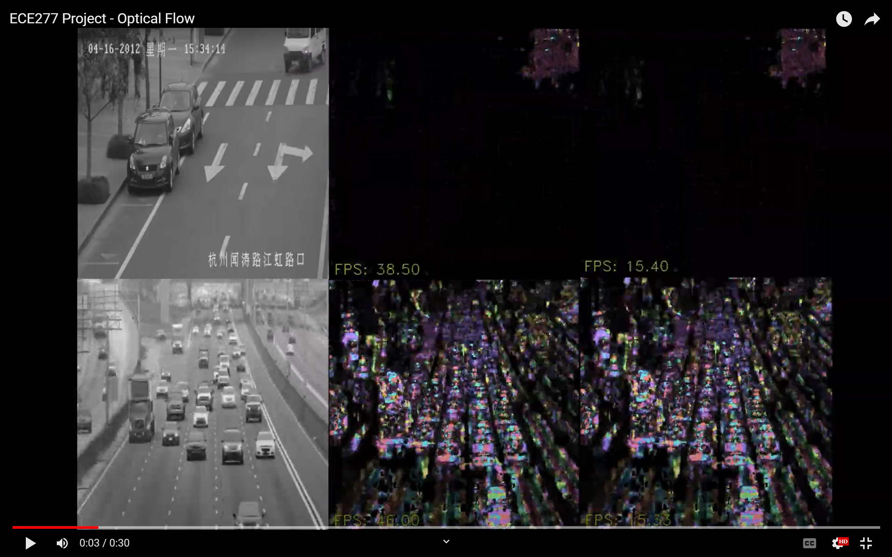
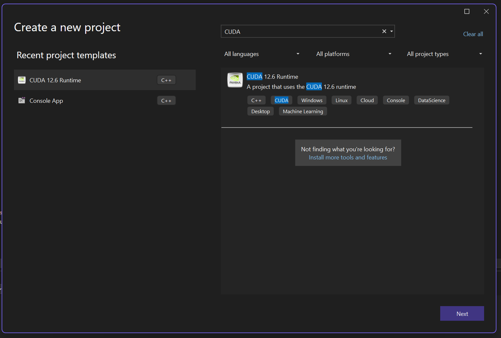
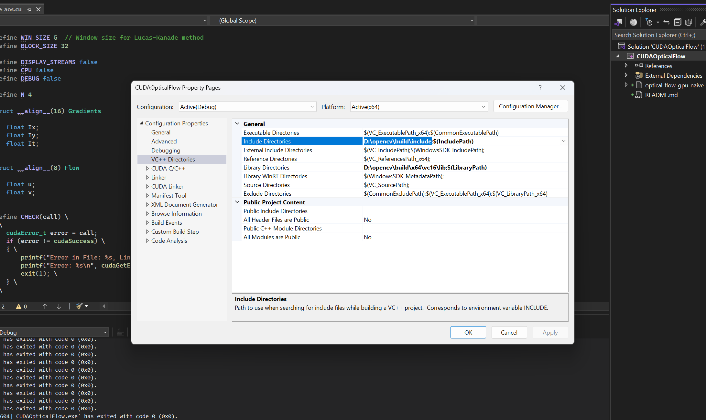
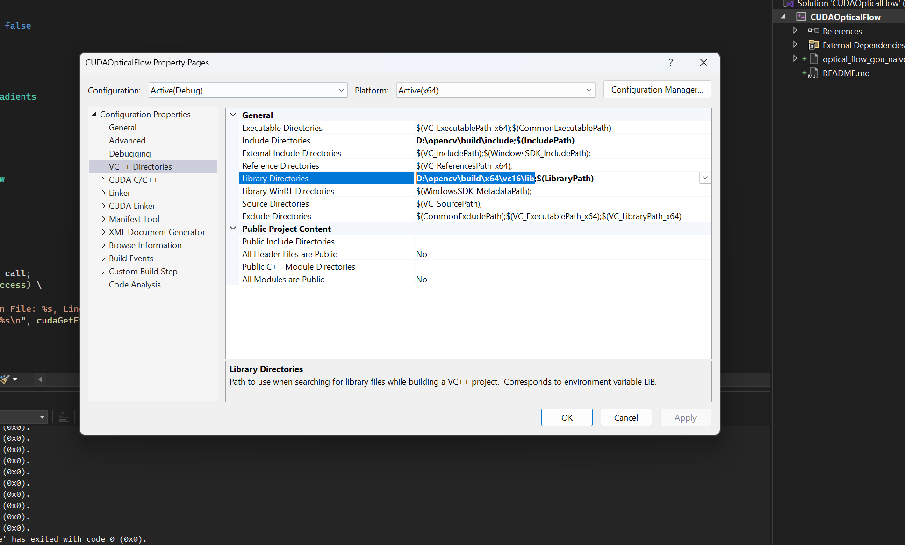
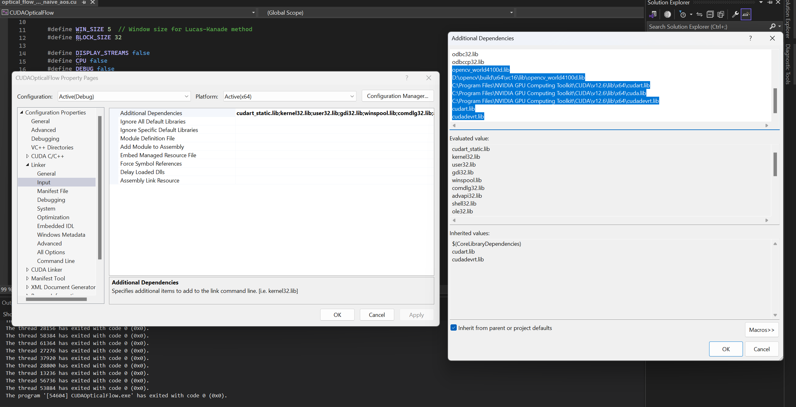
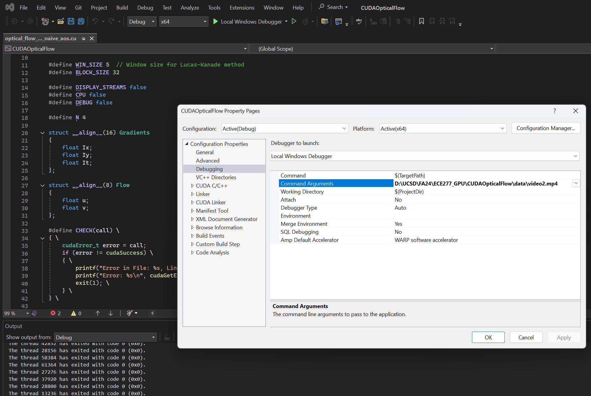

Report - <a href="CUDA Optical Flow.pdf">Link</a>
Video Submission - <a href="https://www.youtube.com/watch?v=wG-psnHYOsk">https://www.youtube.com/watch?v=wG-psnHYOsk</a>

# Create a New CUDA Runtime Project (ignore if using the .sln file)

File -> New -> Project -> CUDA Runtime

# OpenCV Installation

Our project utilizes OpenCV. First step to perform is to install OpenCV from <a href="https://opencv.org/releases/">[OpenCV Releases](https://opencv.org/releases/)</a> and a add -

`<YOUR OPENCV FOLDER>\opencv\build\x64\vc16\bin`

to the `Path` (of your environment variables)

# Adding OpenCV to Visual Studio Project

1. VC++ Directories -> Include Directories -> Add path to `include` folder in opencv.
   

2. VC++ Directories -> Include Directories -> Add path to `opencv/build/x64/vc16/lib` folder in opencv.

3. Linker -> Input -> Additional Dependencies, add the following paths and libraries -

<b>At this point, OpenCV should be added to the project.</b>

# Setup Debugging

The main function expects a video stream as one of the arguments. For the purposes of debugging, it can be added in 

Debugging -> Commad Arguments

